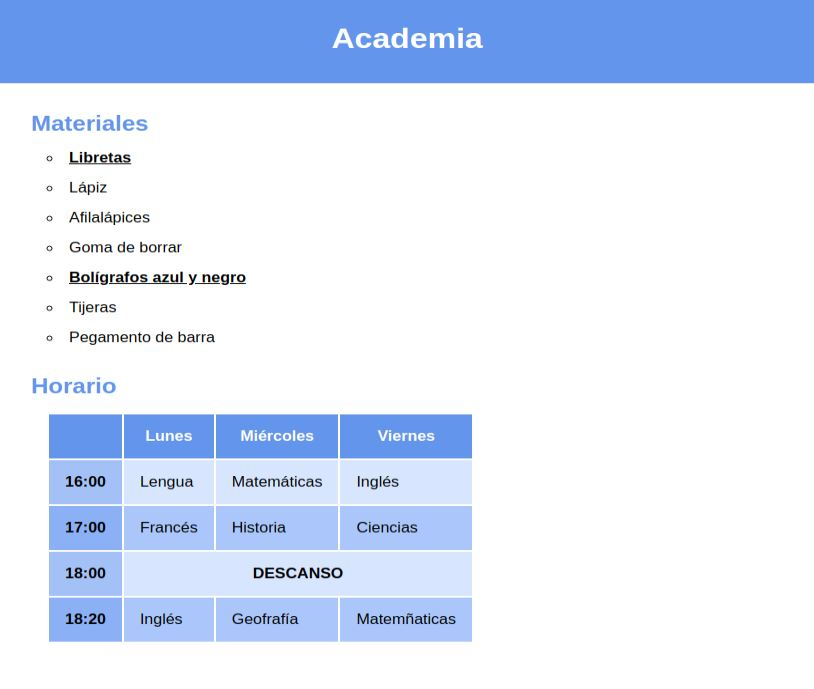

# Selectores

Edita el archivo CSS para dar los estilos necesarios para obtener un resultado como el de la imagen sin modificar el HTML:

Se tendrá en cuenta, por orden de importancia:
1. Los selectores utilizados
2. Las propiedades

No se tendrá en cuenta:
* Los valores (los colores y medidas no tienen por qué ser exactos)

El resultado final debe funcionar correctamente ejecutándolo con live server y no dar ningún error en el [Validador de CSS de la W3](https://jigsaw.w3.org/css-validator/#validate_by_input)