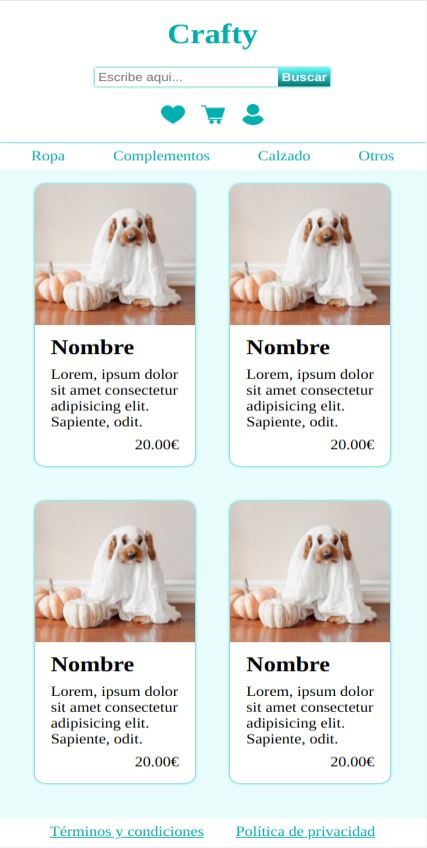
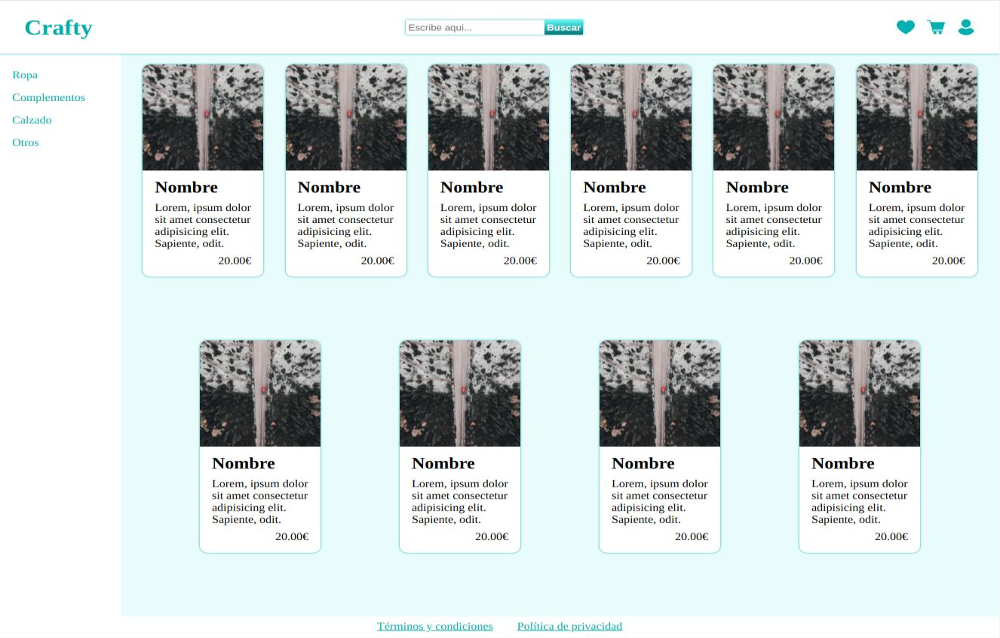

# Layout

Edita el archivo style.css para crear un layout responsive como el de las imágenes:

Usa grid para maquetar el cuerpo de la página y flex para los elementos.

El footer debe verse en la parte de abajo independientemente del número de artículos.

Para ahorrar tiempo, solo tendrás que encargarte de la disposición de los elementos, todo lo demás (colores, tamaños...) ya viene en el documento.

Si quieres practicar, ¡intenta hacerlo desde cero!

El resultado final debe funcionar correctamente ejecutándolo con live server y no dar ningún error en el [Validador de CSS de la W3](https://jigsaw.w3.org/css-validator/#validate_by_input)